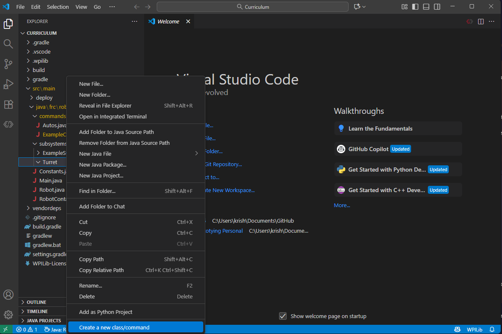

import Quiz from '@site/src/components/Quiz.jsx'

# Basics 101 of Java
Now we start learning a new programming language. The first step is to learn how to create a new file. Then we'll learn how to print out statements, and much more! This is where programming will start to get hard, this is where most people quit, but this is also the start of success if you're willing to persevere. 


## Creating A New File

For this lesson, we're going to use the Programiz Java editor instead of robot code. Open [programiz.com](https://programiz.com/) and start a new Java program. If you already have it open, you can move on to the next step.

You don't need to create folders or robot classes yet. Programiz gives you a file to work in already, which is perfect for learning the basics first.


## Programming Time!
Now we start actually programming stuff such as print statements and variables.

So let's begin. 

### Print Statements

After opening the Programiz Java editor, replace the starter code with this:

```
class Main {
  public static void main(String[] args) {
  
  }
}
```

This is what we call the **main method**. You will learn more about this later, but for now, this is where we'll write all our code. After that, inside this main method, type this line of code: `System.out.println("Hello Steel Hawks");` DON'T FORGET THE SEMICOLON AT THE END


That's it! You have written your first program. So what specifically does this do. The parenthesis are what you want to show to the console. Make sure, whatever text you show has "" around it otherwise it will cause an error. The semicolon indicates an end to that line. After writing any line of code (with a few exceptions), you must put a semicolon.  The console is where these print statements (what you just did) and error messages get shown. 

#### Running Your Code

Now, click the `Run` button in Programiz and watch your code execute.

Afterwards you will find your Hello Steel Hawks message in the output console. When you want to edit that message, just go back to the code and write whatever you want. Or make multiple print statements. Try it out! If you have any questions, please ask a lead programmer.


### Variables
Now were going to talk about variables, what are the main types of variables, how to create and use them.

So what are variables. You can think of variables as containers that store values. Just like in algebra, they can be called by a letter, name, or anything at all! They store values of different types, like text, numbers, and many others.

#### Data Types
So what is a data type. A data type is the type of thing we store in a variable. Text and numbers for example, cannot be stored the same way.

| Data Type | Name | Example |
|------|------|------------ |
| Text | String | "Hello World" |
| Number | int | 5 |
| Decimal | double | 5.4 |
| True/False | boolean | false |
> Note that int and double don't have quotation marks, if you put quotations marks around anything (including numbers), they become the String data type. So be careful what data type you use.

#### Creating Variables

Let's do a small quiz to see if you can develop your own variable:

<Quiz questions={[
  {
    prompt: "For a variable of Name, what data type would you use?",
    options: ["String", "double", "int", "boolean"],
    correct: 0,
    explanation: "A string would be perfect to represent a piece of text, such as your name"
  },
  {
    prompt: "For a variable of Age, what data type would you use: ",
    options: ["double", "float", "int", "boolean"],
    correct: 2,
    explanation: "For age, double is not good because 5.4 isn't and age, and float is not a datatype, so int is the correct choice"
  }
]} />

Now that we got you're concepts down let's actually create a variable. In your Programiz code, create a new variable for your name: `String my_name;`

Then, in our main method (It's that thing that starts with `public static void main(String[] args) {}`), type this: `my_name = "Krish";`

So what exactly did we do here. We created a variable of data type String, and called it my_name. The structure of making a variable is very simple. First you put the data type, then you put the name of the variable.

#### Using Variables

So let's say I wanted to print out "Hi my name is Krish", and I had a variable my_name. I would write this line `System.out.println("Hi my name is " + my_name)` This is called concatination, where you "add" a variable to something else. Variables are used all over our code base, from calculations to datapoints that we log, variables are a key component of everything we do.

## Next Steps
Practice creating variables that define parts of you: Your age, your name, how tall you are (double values) and your favorite thing to eat. Create variables and print statements for these things in Programiz and show them to your lead programmer.

You are officially done with this section! **You may move on to Logic and Loops**
