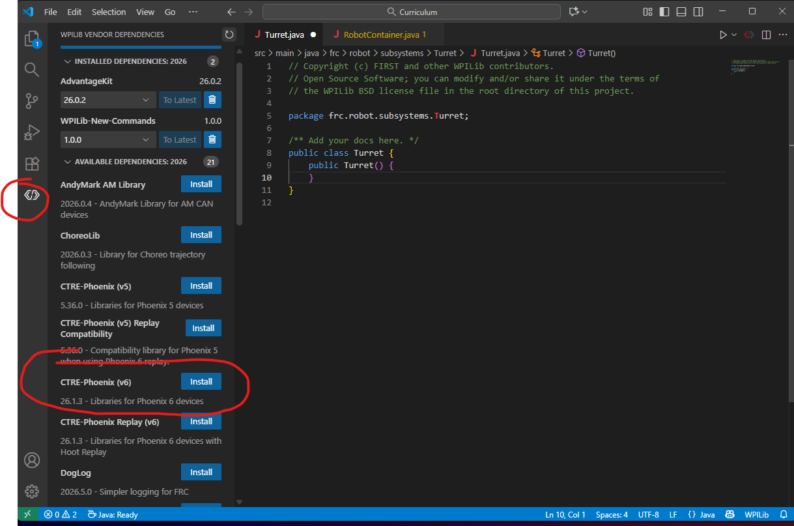

import Quiz from '@site/src/components/Quiz.jsx' 

# Motors

So how do we create and run motors. First we have to go over something called vendordeps, then we can look at how to program motors.

## Vendordeps
As you know, we use a lot of different softwares and programs when we code. To have the robot understand and use these programs we need to install something called vendordeps, which are big libaries that we use to help our robot understand different mechanisms. To install them, go to the bottom-most icon on the left side and click it. In our case, when we're programming motors, so we'll search for something called Phoenix Tuner (or something Phoenix). after you click install, it should start running the installation. After 1 min or so, it should be done. Now, you'll be able to control all motors made by CTRE, which include Talon SRX and Kraken's.





## Creating a motor
In your turret.java file in the Curriculum project (you thought we were done with that?), create a new variable like we create strings and doubles, but don't assign a value yet. **Remember to put this outside the constructor**. This time however, your variable should be a data type of TalonFX (make sure you click enter when the autocomplete option comes up). let's name the motor `s_motor`. The final line should be `private TalonFX s_motor;` TalonFX is the type of motor controller, and we're creating a new motor. You can think of your basic data types, and add TalonFX as one of the datatypes for a motor your running. You're also going to need a canbus (look at hardware 102 if you forgot!!), which we'll create by saying `private CANBus bus`, where CANBus is the data type in this case.

Next, we're going to assign a value to this variable in the constructor. Type this line inside the constructor: `s_motor = new TalonFX(bus, 1)`.

Now what does this mean? So first we create a new instance of a TalonFX (`new TalonFX()`), which corresponds to a certain CANBus, and has a device ID. You might be asking how do you know what the device id is? That's where pheonix tuner comes into play. For more information visit our Software Tools section to learn EVERYTHING about pheonix tuner. 

Now that we've created our motor, let's learn how to run and stop it.

<Quiz questions={[
{
prompt: "What is the primary purpose of installing 'vendordeps' in your robotics project?",
options: [
"To update the operating system of the robot",
"To provide libraries that allow the code to understand and control specific hardware mechanisms",
"To increase the processing speed of the Systemcore",
"To connect the robot to Wi-Fi"
],
correct: 1,
explanation: "Vendordeps are libraries that provide the necessary code to help the robot communicate with and control hardware like CTRE motors."
},
{
prompt: "Where should you declare a new motor variable (like 'private TalonFX s_motor') within your Java class?",
options: [
"Inside the constructor",
"Outside the constructor, at the class level",
"Inside the main method",
"Inside the motor's method"
],
correct: 1,
explanation: "Defining the variable outside the constructor ensures it is a field of the class, meaning it is accessible to all methods within that class."
},
{
prompt: "In the line 's_motor = new TalonFX(bus, 1);', what does the number '1' represent?",
options: [
"The motor's voltage",
"The device ID assigned to that specific motor",
"The number of motors connected",
"The speed limit of the motor"
],
correct: 1,
explanation: "Each motor on the CANBus needs a unique device ID (found via Phoenix Tuner) so the software knows exactly which motor to send commands to."
}
]} />


## Running a motor

So now we're going to create a new method, called runMotor. This method should go outside of the constructor and within the class itself. Let's define it like this: `public void runMotor(double output) {}` The reason we want a parameter of output is because when calling this method, we should be able to choose our output depending on the scenario. 

within this function we're going to type the line `s_motor.set(output)` This is the most simple way to run a motor at a percentage speed. Now see if you can create the stopMotor method, and look below for the full code for the entire file. 

**DON'T CHEAT**

<details>
  <summary>💡 See the solution</summary>

  This is the full code for the entire turret class, starting from the top to the bottom not including imports. 
```java
  class Turret {

    private TalonFX s_motor;
    private CANBus bus;

    public Turret() { // constructor
        s_motor = new TalonFX(bus, 1);
    }

    public void runMotor(double output) {
        s_motor.set(output);
    }

    public void stop() {
        s_motor.stopMotor();
    }
  }
```

 Refer to the code explanations above for any questions, or reach out to a lead or the head programmer with any questions
</details>