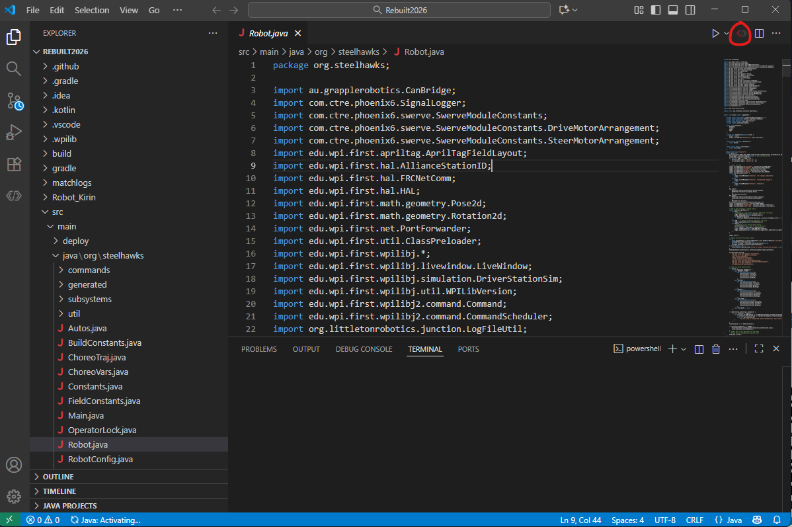
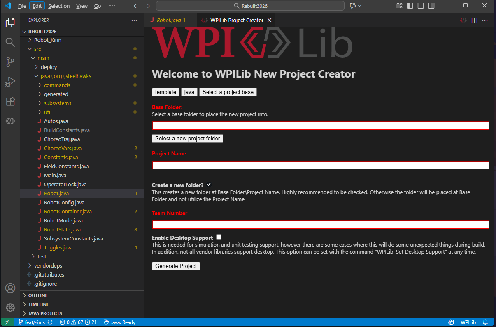
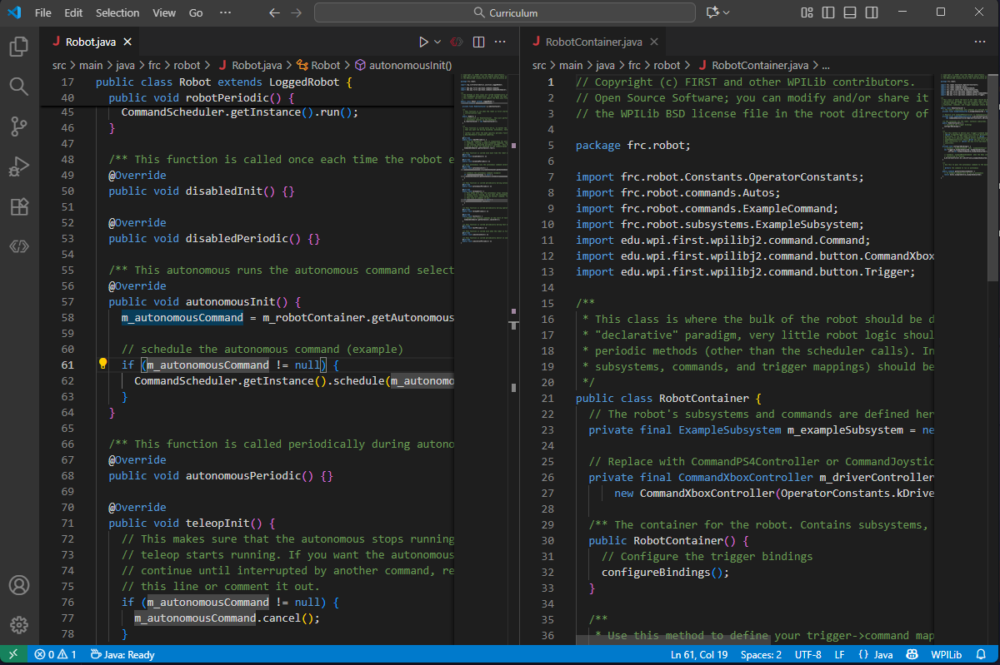
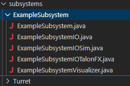

# Explore WPILIB VSCode

In This section we will explore how to create a project, the file structure behind a project how we would create our 2027 project.

## Create a Project through WPILIB 

After opening up, you should be on the welcome page, click the little icon of WPILIB on the top right corner, and type in Create New Project, then click enter:

Alternatively, you can do `ctrl + shift + p` or `cmd + shift + p` on mac and type WPILIB Create new project, then click enter.

After you do that you should be on a page similar to this:

From here, fill template not example, java not cpp, and search Command Robot as a base. This is the most common type that is normally used, however we use something called a LoggedRobot, which you will learn about later. 

After selecting the folder you want it to be in, naming the project: "Curriculum", and giving our team number **(you should know it)**: 2601, click Generate Project.
> Remember the name Curriculum, as we will go back to it after all this setup is done.

## File Structure
Here is where we will explore the folders and files of this project. It's ok not to know much, and you will get used to everything later once you learn a bit of basic java. If you have any questions at this point or are very confused/lost, please reach out to a lead programmer and they will help you. 

### RobotContainer.java and Robot.java

RobotContainer.java is where we **Initialize** our subsystems and configure our controllers. **A subsystem is a specific part of our robot**, such a robot arm, our wheels and driving system (called the drivetrain), and any other mechanisms we want. For example, last year we had a rotating shooter. This is an example of a subsystem that we would be programming.

Robot.java is our main robot loop. This means that every 20 milliseconds, we are monitoring the robot. We also  **Initialize** our robot container and **Command Scheduler**. These things are a necessity for our robot to run. Robot.java isn't touched that much, and we mainly do all of our configurations in RobotContainer.java.

> P.S. It's ok if you don't know what any of the bold words mean (Initialize, Loops, Command Scheduler). These are relatively advanced concepts, and will definitely be covered. If you're curious about them ask a lead programmer.

### Subsystems

This is where we will create our subsystems (big parts of the robot), we usually have a folder for each subsystem, which consists of five files you will dive into later. These five files allow for us to have immense control over the mechanisms and create a boilerplate pattern based way to program each subsystem, making this easy peasy. Each subsystem would look something like this:

### Commands

We will cover commands in depth later too, but they are a way of basically telling a robot what do specifically, and are capable of being modified to create a combination of commands, which streamline effiency. Don't worry about this folder too much yet.

## Next Steps

Good Job! You have sucessfully downloaded and installed WPILIB, created your first project, and learned about subsystems and our main files. Now it's time to delve into actual programming, but before that we have to cover one more topic in depth: Github. After that, you'll become a Java Pro. You can now move onto the next Section **Github Basics**