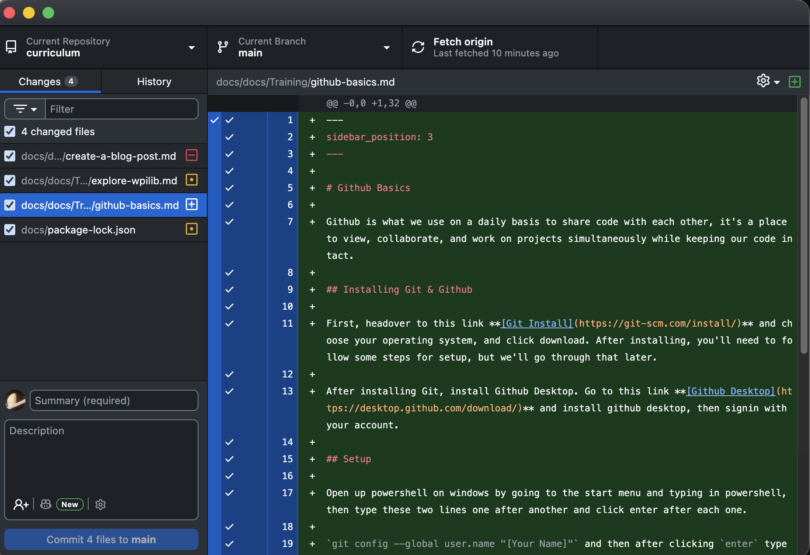
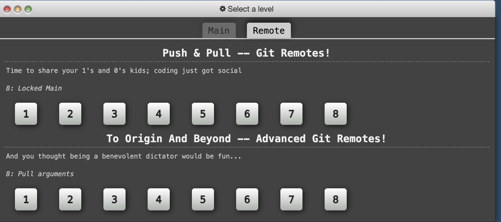

# Github Basics

Github is what we use on a daily basis to share code with each other, it's a place to view, collaborate, and work on projects simultaneously while keeping our code intact.

## Installing Git & Github

First, headover to this link **[Git Install](https://git-scm.com/install/)** and choose your operating system, and click download. After installing, you'll need to follow some steps for setup, but we'll go through that later. 

After installing Git, install Github Desktop. Go to this link **[Github Desktop](https://desktop.github.com/download/)** and install github desktop, then signin with your account.

## Setup

Open up powershell on windows by going to the start menu and typing in powershell, then type these two lines one after another and click enter after each one.

`git config --global user.name "[Your Name]"` and then after clicking `enter` type `$ git config --global user.email [Your Personal Email]` and clicke enter again. Now you have set up git and github desktop.

## Github Basics
Now we will talk about how to use github, when to use github, and some best practices.

### How to Use Github
First, let's go over some vocab: A **repository** is a project that is on github, a **commit** is a add-on or change that you make to a repo, and when you **push** that commit, you basically apply that change to the repo on github for everyone to see.

So, the most simplistic way of using Github Desktop is to code like normal, then open up Github Desktop and go to the corresponding repo, which will show you all the changes you have made.

Put a simple summary, and maybe a description if you have more than a few words or more than one concept to say, then click commit. After it's commited, you'll see an option to push the code, which will lead to it being in github on the web. **Congratulations, you have learned how to commit and push code!**

### When To Use Github

You should use github whenever you create code and codebases (large projects) in order to store your code somewhere safe, and also so that other people can collaborate, push, and improve your current code. Github also makes code open-source, which means anyone can access it as long as it's public. 

### Best Practices

So when do you commit, push, or pull (to recieve someone else's changes and updates) to your codebase. 

You should commit whenever you finish your coding session, and push whenever you reached a goal or point, for example, if you're working on a main subsystem file over multiple sessions, then commit each session and push once that file is complete. 

You should pull your repo every time you start working, in order to stop something called merge conflicts, which you will learn about later. But if you forget, it's not the end of the world, as Github Desktop handles these conflicts quite well.

## Next Steps

Now that you've learned the basics, it's time for some real practice. Head over to **[Git Branching](https://learngitbranching.js.org/)** and practice. Go over Introduction to Sequences: 1, 2, 3, and 4. Then Go to Remote,

and go through **EVERYTHING** because this will be very useful and neccessary in the future. This is considered your first homework, so please complete it as soon as possible. 

Remember this is a two way commitment, and you need to put in the work for you to get amazing results, and it starts with going through long and tedious processes to learn.

**After you're done with this section, you can finally learn Java!. Please move on to the next section of Basics 1 of Java.**