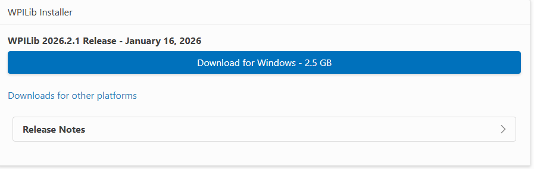
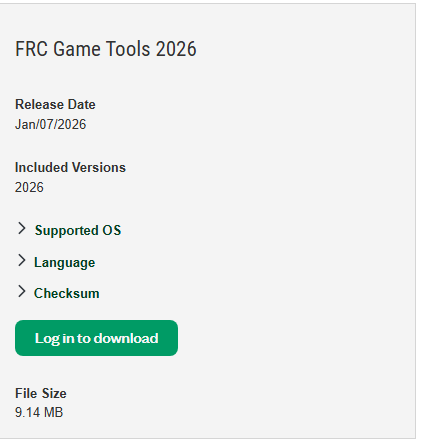

# Get Set Up

Install WPILIB and NI Tools and learn all about them

## Install WPILIB

For Robot Code, We use a library called WPILIB. This library enables us to program and control robots through java.

 Head over to this link: **[WPILIB Dowload Page](https://docs.wpilib.org/en/latest/docs/zero-to-robot/step-2/wpilib-setup.html])** and look for a big blue button that says **Download For Windows/MacOS/Linux**

 

 After Going through the installation prompts (**MAKE SURE TO CLICK INSTALL VSCODE**) you will be able to open WPILIB VSCode. If you're unsure of anything during the installation process, don't be afraid to reach out to a lead programmer to help you. Asking for help is always better than making a mistake that costs you valuable time.

### Windows

Go to the start menu and search for WPILIB VSCode 2026, it should appear if installation was successful. If it appears, Click on it, if not reach out to a lead programmer to figure out why it didn't, or to help with installation. 

### MacOs

Use this Shortcut: `cmd + space` in order to open up the search bar, then search for WPILIB VSCode 2026. Again, if it shows up then click on it, if not then ask a lead programmer for help. 

## NI Game Tools

We use more than WPILIB to help us code. there are many types of software out there that enable us to track data, and also help with actually configuring and driving the robot.

### Download NI Game Tools

**FOREWARNING: THESE GAME TOOLS WILL NOT ALLOW YOU TO SEND CODE TO THE ROBOT ON A MAC, AND YOU CAN SKIP THIS STEP IF YOU HAVE A MACBOOK.**

To download these tools, head over to this website: **[NI Game Tools](https://www.ni.com/en/support/downloads/drivers/download.frc-game-tools.html#581857)**. Once you're there, you will have to login to download the game tools. Now unfortunately, the only way we run robot code on the actual robot is through a windows computer, so if you have a mac this step is not neccessary, and you can head over to the **Explore WPILIB** Section.

For windows users, you will have to create an account. Then you will be redirected back to that page, and you will be able to download the tools. After downloading all of them and accepting any agreements, you may proceed to the next section.

